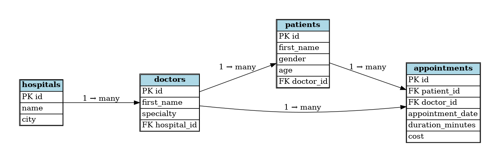

# Introduction to SQL

## Learning Objectives

By the end of this lesson, you will be able to:

1. Explain what a relational database is and why SQL is used to query it
2. Write basic `SELECT` queries to retrieve data from a table
3. Filter rows using `WHERE` with conditions and logical operators
4. Combine data from multiple tables using `JOIN`
5. Summarise data using aggregate functions (`COUNT`, `SUM`, `AVG`, `MAX`, `MIN`)
6. Group and filter grouped results using `GROUP BY` and `HAVING`
7. Sort and limit results using `ORDER BY` and `LIMIT`
8. Recall the mandatory order of SQL clauses in a query

## Overview

| Topics                                                                            |
| --------------------------------------------------------------------------------- |
| [**1 -Databases & SQL: the big picture**](#1---databases--sql-the-big-picture) |
| [**2 - `SELECT` & `FROM`: reading data**](#2---select--from-reading-data)  |
| [**3 - `WHERE`: filtering rows**](#3---where-filtering-rows)                 |
| [**4 - `JOIN`: combining tables**](#4---join-combining-tables)               |
| [**5 - Aggregate functions**](#5---aggregate-functions)                        |
| [**6 - `GROUP BY` & `HAVING`**](#6---group-by--having)                     |
| [**7 - `ORDER BY` & `LIMIT`**](#7---order-by--limit)                       |
| [**8 - Query and Execution Order**](#8---query-and-execution-order)            |
| [**9 - Practice**](#9---practice)                                            |
| [**References & Further Reading**](#references--further-reading)                                            |


## 1 - Databases & SQL: The Big Picture

### What is a Relational Database?

A **relational database** stores data as a collection of **tables**, think of each table like a single sheet in a well-organised spreadsheet. Each table has:

- **Columns**: the attributes (e.g. `name`, `age`, `city`)
- **Rows**: individual records (e.g. one customer, one order, one pet)

Tables are linked to each other through **keys**. A **primary key** (`PK`) is a column that uniquely identifies every row in a table. A **foreign key** (`FK`) in one table references the primary key of another, this is the "relational" part.

> **Analogy:** Imagine a studio of doctors. Patients are in one table, doctors in another. The patients table has a `doctor_id` column that points to the `id` column in the doctors table. This way, we can connect each patient to their doctor without repeating all the doctor's information in every patient record.

### What is SQL?

**SQL** (Structured Query Language) is the standard language for talking to a relational database. You write a **query**, a precise instruction, and the database engine returns exactly the data you asked for.

SQL is used by:

- Data scientists retrieving data for analysis
- Engineers reading and writing application data
- Analysts building dashboards and reports

### PostgreSQL & DBeaver

We are using **PostgreSQL**, one of the most widely-used open-source relational databases. We connect to it via **DBeaver**, a free graphical tool. DBeaver lets you write SQL queries and see the results in a user-friendly interface. You can also explore the database structure, view table contents, and manage connections.

## SQL Queries: The Basics

Make sure you have set up your database connection and opened a SQL editor with the correct schema (see [Database Connection](../database_connection.md)) so that you are ready for the exercises.

> [!IMPORTANT]
> The examples that you find in each section are not meant to be run. They are for illustrative purposes only.


The following is the schema for the examples we will use in this lesson. It contains tables about patients, doctors, hospitals, and appointments.



### 2 - `SELECT` & `FROM`: Reading Data

Every SQL query begins by answering two questions:

1. **What columns do you want?** → `SELECT`
2. **Which table are they in?** → `FROM`

```sql
SELECT column_name
FROM table_name;
```

#### Selecting Multiple Columns

```sql
-- Select specific columns separated by commas
SELECT column_name_1, column_name_2, column_name_3
FROM table_name;
```

#### Selecting All Columns

```sql
-- The * wildcard means "give me everything"
SELECT *
FROM table_name;
```

> [!TIP]
> **When to use `*`:** Great for exploring a new table. In production queries, always name your columns explicitly, it is clearer and faster.

#### Removing Duplicates with `DISTINCT`

```sql
-- Return only unique values in a column
SELECT DISTINCT column_name
FROM table_name;
```

> [!NOTE]
> `SELECT` decides *which columns* you see. `DISTINCT` removes duplicate rows from the result.

## 3 - `WHERE`: Filtering Rows

### Why Filter?

Real tables have millions of rows. You almost never want all of them. `WHERE` lets you describe exactly which rows to return.

```sql
SELECT column_name
FROM table_name
WHERE condition;
```

#### Comparison Operators

| Operator         | Meaning               |
| ---------------- | --------------------- |
| `=`              | Equal to              |
| `<>` or `!=`     | Not equal to          |
| `>`              | Greater than          |
| `<`              | Less than             |
| `>=`             | Greater than or equal |
| `<=`             | Less than or equal    |

**Example**:

```sql
-- Get all patients who are female
SELECT *
FROM patients
WHERE gender = 'female';
```

#### Combining Conditions

Use `AND` and `OR` to chain multiple conditions:

**Examples**:

```sql
-- Male patients aged between 20 and 50
SELECT *
FROM patients
WHERE gender = 'male'
  AND age >= 20
  AND age <= 50;
```

A cleaner way to express a range:

```sql
-- BETWEEN is inclusive on both ends
SELECT *
FROM patients
WHERE gender = 'male'
  AND age BETWEEN 20 AND 50;
```

#### Matching a List with `IN`

```sql
-- Get hospitals from specific cities
SELECT *
FROM hospitals
WHERE city IN ('Berlin', 'Hamburg', 'Munich');
```

#### Pattern Matching with `LIKE`

```sql
-- Get patient names that start with 'A' (% means "any characters")
SELECT *
FROM patients
WHERE first_name LIKE 'A%';
```

> [!NOTE]
> `WHERE` filters *rows*. It runs before any aggregation, so it operates on raw individual records.

## 4 - `JOIN`: Combining Tables

### Why Join?

In a relational database, related data lives in *separate* tables to avoid repetition. A `JOIN` stitches tables back together for a query by matching rows on a shared key.

#### INNER JOIN: Only Matching Rows

Returns rows that have a **match** in **both** tables. Rows with no match are excluded.

```sql
-- t1 and t2 are aliases for table_name_1 and table_name_2
SELECT t1.column_name, t2.column_name, 
FROM table_name_1 AS t1
INNER JOIN table_name_2 AS t2 ON t1.key = t2.key;
```

The syntax combines two tables based on a **related column**, and the `ON` keyword is used to specify the **matching condition**. `key` is usually a primary key / foreign key pair.

> **Analogy:** Two guest lists for a party. `INNER JOIN` gives you people who appear on *both* lists.

**Example**:

```sql
-- p is an alias for patients, d is an alias for doctors
SELECT p.first_name, d.first_name, d.city
FROM patients AS p
INNER JOIN doctors AS d ON p.doctor_id = d.id;
```

> [!TIP]
> Use table aliases to keep things readable using `AS`. This is especially helpful when joining multiple tables or when table names are long.

#### LEFT JOIN: All Rows from the Left Table

Returns **every row from the left table**, plus matching rows from the right. Where there is no match, the right-side columns are `NULL`.

**Example**:

```sql
-- All patients, even if their doctor is not in the doctors table
SELECT p.first_name, d.first_name
FROM patients AS p
LEFT JOIN doctors AS d ON p.doctor_id = d.id;
```

> [!NOTE]
> The **Left Table** is the one that appears immediately after `FROM`. The **Right Table** is the one being joined to it.

#### FULL JOIN: All Rows from Both Tables

Returns all rows from both tables. `NULL` fills in wherever there is no match on either side.

```sql
-- All patients and their doctors, even if there is no match
SELECT p.first_name, d.first_name
FROM patients AS p
FULL JOIN doctors AS d ON p.doctor_id = d.id;
```

Other join types (e.g. `RIGHT JOIN`, `CROSS JOIN`) exist but are less commonly used. The three above cover the vast majority of use cases.

> [!IMPORTANT]
> Sometimes you need to join more than two tables to get more information. Just chain multiple `JOIN` clauses together:

**Example**:

```sql
-- Get patient name, doctor name, hospital name,
-- and appointment date by joining four tables

SELECT
    p.first_name,
    d.first_name,
    h.name,
    a.appointment_date
FROM patients AS p
INNER JOIN doctors AS d
    ON p.doctor_id = d.id
INNER JOIN hospitals AS h
    ON d.hospital_id = h.id
INNER JOIN appointments AS a
    ON p.id = a.patient_id;
```

> [!TIP]
> **How to read multiple joins?** Start from the `FROM` table and read each `JOIN` as "bring in this table and match it on these keys". The order of joins can matter if there are multiple matches or if you use different join types.
>
> **How it works:** The joins are processed in the order they appear, so the first join creates a temporary result set that the next join operates on.


### How to choose the right `JOIN` type?

Start with the **business question**, not the SQL syntax.

Ask yourself:

**What records should appear in my final report if some data is missing?**

* Use **`INNER JOIN`** → when you only care about records that exist in **both tables**

  Business question:
  *“Show only customers who actually placed an order.”*

  → Customers without orders are excluded.
* Use **`LEFT JOIN`** → when one table is your **main population** and you want to keep all of it

  Business question:
  *“Show all customers and any orders they may have placed.”*

  → Customers without orders still appear (`NULL` for order information).
* Use **`FULL JOIN`** → when you want to analyse **both sides completely**, even when relationships are missing

  Business question:
  *“Show all customers and all orders, including unmatched records.”*

  → Useful for audits, data quality checks, and reconciliation.

A practical way to think about joins:

**Who should still appear in the report if related data is missing?**

That answer usually tells you which JOIN to use.


## 5 - Aggregate Functions

### What is an Aggregate?

An **aggregate function** collapses many rows into a single summary value.

| Function           | What it returns                        |
| -------------------| ---------------------------------------|
| `COUNT(*)`         | Number of rows.                        |
| `COUNT(column)`    | Number of non-NULL values in a column. |
| `SUM(column)`      | Total of all values.                   |
| `AVG(column)`      | Mean value.                            |
| `MAX(column)`      | Largest value.                         |
| `MIN(column)`      | Smallest value.                        |
| `ARRAY_AGG(column)`| Combines multiple rows into a single array.   |

**Examples**:

```sql
-- How many patients are there in total?
SELECT COUNT(*) AS total_patients
FROM patients;

-- What is the average age of all patients?
SELECT AVG(age) AS average_age
FROM patients;

-- What is the longest appointment duration?
SELECT MAX(duration_minutes) AS longest_appointment
FROM appointments;
```

> [!NOTE]
> Aggregate functions summarise data. They are almost always paired with `GROUP BY` (next block) to compute summaries *per group*, not just for the entire table.

## 6 - `GROUP BY` & `HAVING`

### Why GROUP BY?

`GROUP BY` splits the table into groups and applies an aggregate function to **each group separately**.

**Example**:

```sql
-- Count appointments broken down by appointment date

SELECT
    appointment_date,
    COUNT(*) AS total_appointments
FROM appointments
GROUP BY appointment_date;
```


This returns one row per unique appointment date, showing the count for each.

### Multiple Grouping Columns

```sql
-- Count appointments broken down by gender AND city

SELECT
    p.gender,
    p.city,
    COUNT(*) AS total_appointments
FROM appointments AS a
INNER JOIN patients AS p
    ON a.patient_id = p.id
GROUP BY p.gender, p.city;
```

> [!NOTE]
> Every column in `SELECT` that is *not* inside an aggregate function **should** appear in `GROUP BY`.


**Example `ARRAY_AGG()`**:

`ARRAY_AGG()` combines multiple rows into a single array.


```sql
-- Get each patient's name and a list of all their appointment dates
SELECT
    p.first_name,
    ARRAY_AGG(a.appointment_date) AS appointment_dates
FROM patients AS p
INNER JOIN appointments AS a
    ON p.id = a.patient_id
GROUP BY p.first_name;
```

**Output**:

| first_name | appointment_dates                    |
| ---------- | ------------------------------------ |
| Anna       | {2025-01-10, 2025-02-14, 2025-03-01} |
| Marco      | {2025-01-12}                         |
| Sofia      | {2025-01-20, 2025-02-05}             |

**Explanation**:

* `GROUP BY p.first_name` → create one group per patient
* `ARRAY_AGG(a.appointment_date)` → collect all appointment dates into a list
* Result → one row per patient with all appointments together


### Filtering Groups with `HAVING`

`WHERE` filters individual rows *before* grouping. `HAVING` filters the *grouped results* it can reference aggregate values.

**Example**:

```sql
-- Count appointments per hospital, but only show hospitals with more than 100 appointments
SELECT h.name,
COUNT(*) AS total_appointments
FROM appointments AS a
INNER JOIN doctors AS d
ON a.doctor_id = d.id
INNER JOIN hospitals AS h
ON d.hospital_id = h.id
GROUP BY h.name
HAVING COUNT(*) > 100;
```

**WHERE vs HAVING at a glance:**

|            | Runs                | Filters                      |
| ---------- | ------------------- | ---------------------------- |
| `WHERE`  | Before `GROUP BY` | Individual rows              |
| `HAVING` | After `GROUP BY`  | Grouped results / aggregates |

## 7 - `ORDER BY` & `LIMIT`

### Sorting with ORDER BY

Results from a database have no guaranteed order unless you ask for one.

```sql
-- Sort patients by age, youngest first
SELECT first_name, age
FROM patients
ORDER BY age ASC;

-- Sort by age, oldest first
SELECT first_name, age
FROM patients
ORDER BY age DESC;

-- Sort by multiple columns:
-- first by hospital name alphabetically,
-- then by number of appointments from highest to lowest
-- For each hospital, which specialties have the most appointments?

SELECT
    h.name AS hospital_name,
    d.specialty,
    COUNT(*) AS total_appointments
FROM appointments AS a
INNER JOIN doctors AS d
    ON a.doctor_id = d.id
INNER JOIN hospitals AS h
    ON d.hospital_id = h.id
GROUP BY h.name, d.specialty
ORDER BY h.name ASC, total_appointments DESC;
```

### Limiting Results with LIMIT

```sql
-- Return the top 3 hospitals by number of appointments

SELECT
    h.name AS hospital_name,
    COUNT(*) AS total_appointments
FROM appointments AS a
INNER JOIN doctors AS d
    ON a.doctor_id = d.id
INNER JOIN hospitals AS h
    ON d.hospital_id = h.id
GROUP BY h.name
ORDER BY total_appointments DESC
LIMIT 3;
```

> [!NOTE]
> `LIMIT` is great for previewing large tables or finding top/bottom N records. Always pair it with `ORDER BY`, otherwise the "top 3" is arbitrary.

## 8 - The Mandatory Query Order

SQL clauses **must appear in this fixed order** in every query. You cannot rearrange them.

```
1. SELECT      ← what columns to return
2. FROM        ← which table (and any JOINs)
3. WHERE       ← filter individual rows
4. GROUP BY    ← group the filtered rows
5. HAVING      ← filter the groups
6. ORDER BY    ← sort the result
7. LIMIT       ← cap the number of rows returned
```

Not every clause is required. The only mandatory ones are `SELECT` and `FROM`. Everything else is optional, but when used, they must appear in the order above.

> [!IMPORTANT]
> The execution order of SQL is different from the written order.

The database engine processes the query in a specific sequence to produce the final result, which is important to understand when writing complex queries:

```
1. FROM        ← start with the base table(s) and apply JOINs
2. WHERE       ← filter rows based on conditions
3. GROUP BY    ← group the remaining rows
4. HAVING      ← filter groups based on aggregate conditions
5. SELECT      ← choose which columns to return and compute aggregates
6. ORDER BY    ← sort the final result set
7. LIMIT       ← return only the specified number of rows
```

### Full Example: Putting it all together

```sql
-- Which gender + age combinations had more than 10 appointments,
-- and what were the top 5 by total appointments?

SELECT
    p.gender,
    p.age,
    COUNT(*) AS total_appointments
FROM appointments AS a
INNER JOIN patients AS p
    ON a.patient_id = p.id
WHERE a.appointment_date >= '2025-01-01'
GROUP BY p.gender, p.age
HAVING COUNT(*) > 10
ORDER BY total_appointments DESC
LIMIT 5;
```

## 9 - Practice

In the SQL script you created for the exercises, you can write your queries, and run them by clicking on the little yellow arrow (or using control + enter).

### Exercise 1

Explore all tables in the schema **introduction** and use SQL to:

- Get all cases for women
- Get all cases for men between 20 and 50

### Exercise 2

Let us now get some more information by joining tables together. Use SQL to:

+ Get all cases for women (including gender names)
+ Get all cases for women (including gender names AND age_bucket names)
+ Get all cases for men between 20 AND 50 including gender names AND age_bucket names

### Exercise 3

- Get all cases for women ORDER them BY age_GROUPs ASCending
- ... AND also BY date (extra)
- Get all cases for men between 20 AND 50, ORDER them BY record_date DESCending

### Exercise 4

- Get average number of cases for women
- Get maximum number of cases for men

### Exercise 5

- Get sum of cases per gender per age GROUP

### Exercise 6
- Get all the dates with more then 80,000 cases.


## References & Further Reading

- [**Database**](https://en.wikipedia.org/wiki/Database)
- [**Types of Database Management Systems**](https://www.c-sharpcorner.com/UploadFile/65fc13/types-of-database-management-systems/)
- [**PostgreSQL Create Table**](https://www.postgresqltutorial.com/postgresql-create-table/)
- [**SQL Joins Explained Visually**](https://theartofpostgresql.com/blog/2019-09-sql-joins/)
- [**SQL Joins Explained Visually**](https://theartofpostgresql.com/blog/2019-09-sql-joins/)
- [**PostgreSQL Aggregate Functions**](https://www.postgresql.org/docs/current/functions-aggregate.html)
- [**W3Schools SQL Reference**](https://www.w3schools.com/sql/)
