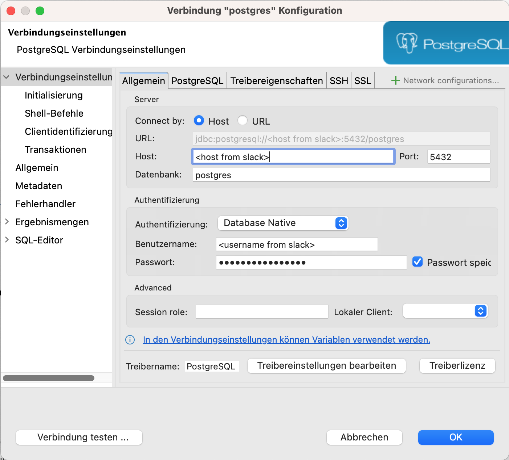
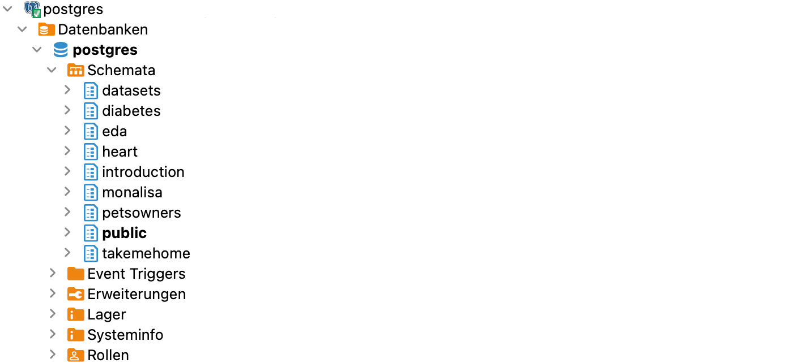

# Database Connection

All exercises in this repository run against a shared PostgreSQL database. You connect to it with DBeaver, the database client you already have installed. Follow these steps once before starting the lesson.

## 1. Create a PostgreSQL connection

Open DBeaver and click the **new connection** icon (the plug with a plus). Select **PostgreSQL**, then fill in the connection details:

- **Host**
- **Database**
- **User**
- **Password**
- **Port**

The credentials are shared with you by the coaches. Click **Test Connection**. If DBeaver offers to download a driver, accept it.

> [!CAUTION]
> These credentials are secrets. Never paste them into your SQL scripts, commit them to the repository, or share them publicly.

A successful configuration looks like this:



## 2. Open a SQL editor and set the schema

In the left panel, expand your connection down to **postgres → databases → postgres → schemas**.



Right-click the schema you need (start with `introduction`), then choose **SQL Editor → New SQL script**. Set the active schema at the top of every script, and run statements with **Ctrl + Enter**:

```sql
SET SCHEMA 'introduction';
```

You are now ready to begin with the [SQL Basics](1_SQL_Basics/sql_basics.md).
